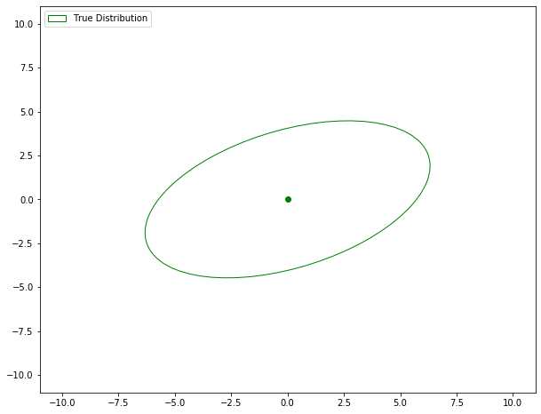

# Visualization of Gibbs Sampling for 2D Gaussian distribution

Create a simple GIF to visualize how Gibbs sampling samples from a 2D Gaussian distribution.

Code accompanying my blog post: [Implementing Gibbs sampling in Python](https://mr-easy.github.io/2020-05-21-implementing-gibbs-sampling-in-python/)

The true distribution is:

  

Sampled points using Gibbs sampling and the estimated Gaussian:

  

See the python notebook for complete code: <a href="Gibbs_from_2d_normal.ipynb">Gibbs_from_2d_normal.ipynb</a>.
